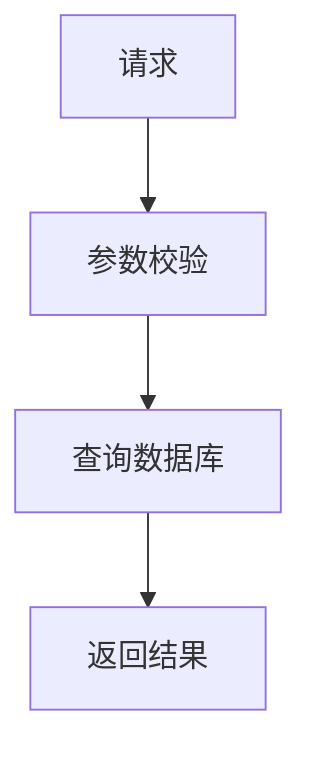
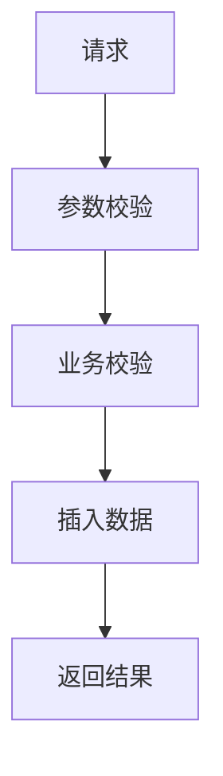
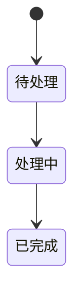

# sto-claw 业务流程图

## 1. 查询流程

```mermaid
graph TD
    A[请求] --> B[参数校验]
    B --> C[查询数据库]
    C --> D[返回结果]
```

## 2. 新增流程

```mermaid
graph TD
    A[请求] --> B[参数校验]
    B --> C[业务校验]
    C --> D[插入数据]
    D --> E[返回结果]
```

## 3. 状态流转

```mermaid
stateDiagram-v2
    [*] --> 待处理
    待处理 --> 处理中
    处理中 --> 已完成
```
